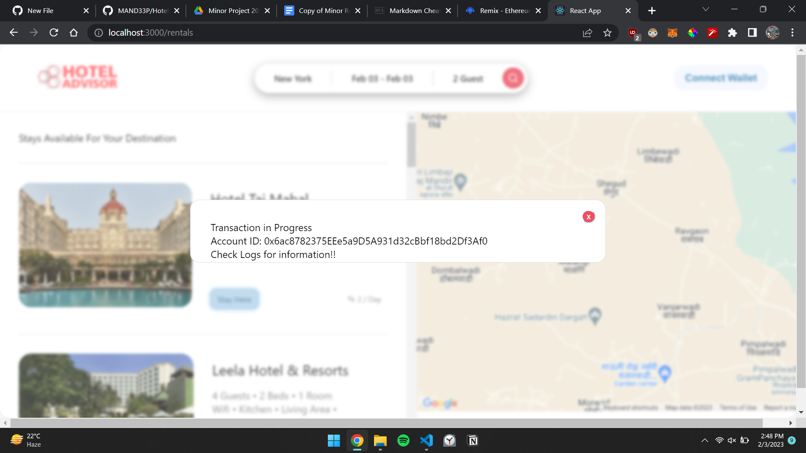
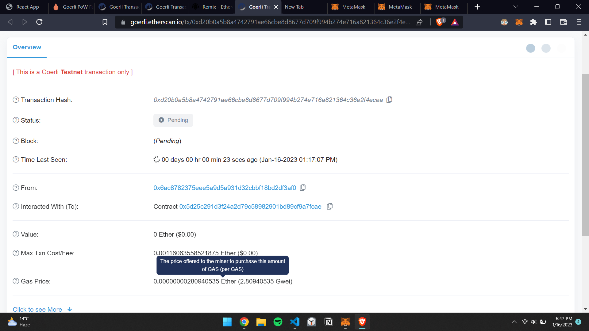

# Hotel Booking DAPP

## Tech Used:
1. Solidity
2. React
3. Remix IDE

### Steps For Using this Project
1. Clone This repository
2. Run command ` yarn start` in terminal.
 3. Install [Metamask Extension](https://chrome.google.com/webstore/detail/metamask/nkbihfbeogaeaoehlefnkodbefgpgknn?hl=en) .
 4. Launch [Remix IDE](https://remix.ethereum.org/#optimize=false&runs=200&evmVersion=null&version=soljson-v0.8.7+commit.e28d00a7.js) and Paste Airbnb.sol code here.
5. Setup [Moralis.io](https://moralis.io/) server.
6. Thats it.

Note: This project also have Google Map API integration. You can generate you free API and use it.

 
 

 

#  **Images**

 

###  Smart contract Screenshot

 

`END` 

